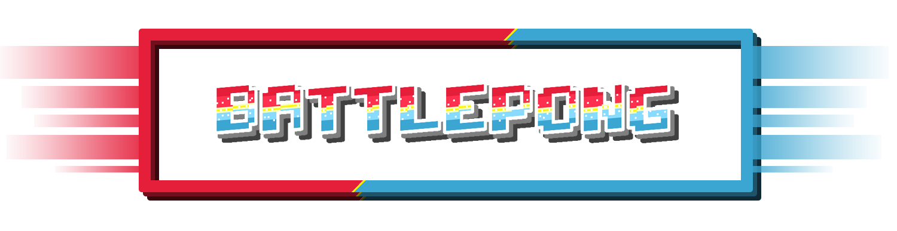

# BattlePong

A pong tribute fused with many other retro games to create a full new pong experience.
Challenging game modes for 1 and 2 players.

This is a game (demo/protoype/vertical slice) developed by students from <a href="https://www.imagecampus.edu.ar/">Image Campus</a>

   

## Credits

- **Gaspar Nuñez** - *Programming* -     
- **Facundo Cedolini** - *Testing* - 
- **Leonardo Perugini** - *Art and Programming* -   
- **Maximiliano Abel Duarte** - *Audio* - 
- **Ramiro Salto** - *First Concept Art* - 

This game was also possible thanks to the support of these professors:

- **Sergio Baretto**
- **Federico Barra**
- **Jorge Cuéllar**
- **Fernando Puig**
- **Eugenio Taboada**

## Acknowledgements

Thanks.

## Links

Download it from itch.io: https://thekhumi.itch.io/battlepong
